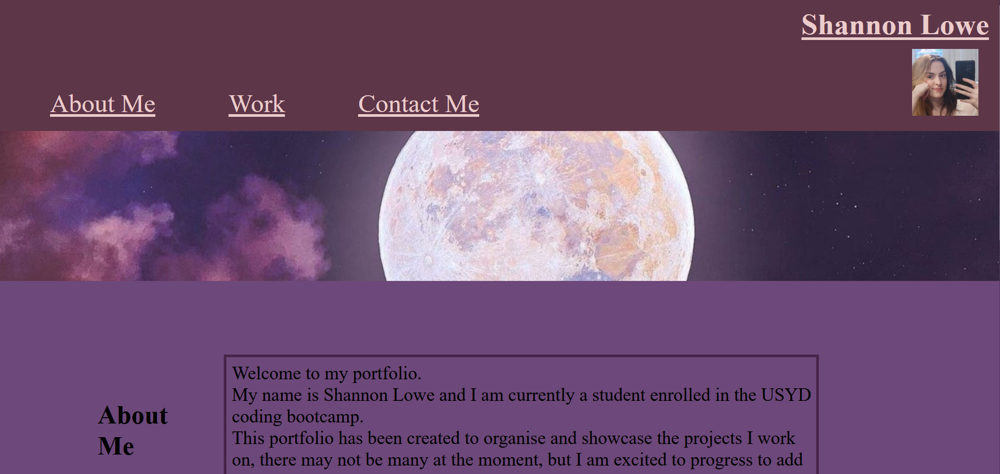
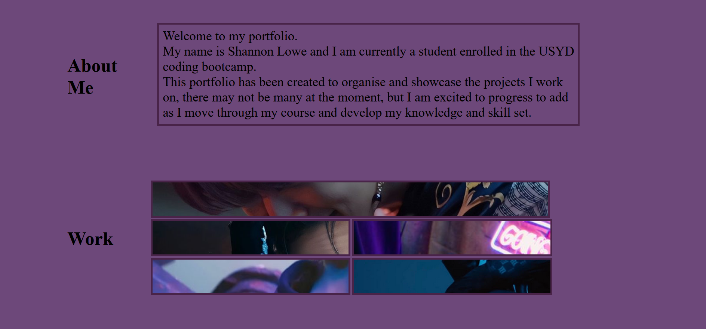
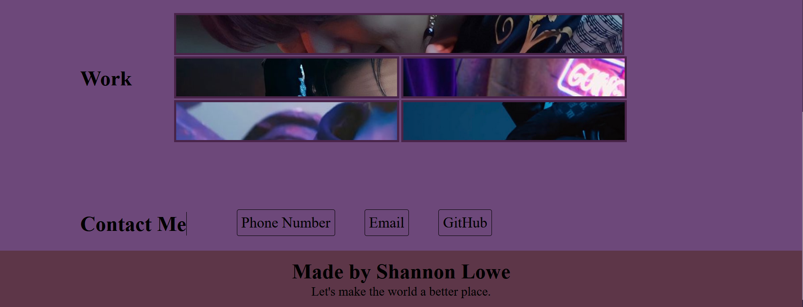

# Portfolio

I have created a portfolio page that allows me to display my work as I progress through the bootcamp course.
 Showcasing my skills and talents to future employers, as many employees require a portfolio with projects on them when considering applicants.

 I currently do not have any projects but I have placeholders for now, as I know I will soon be creating projects to show of my knowledge and skills.

 Within this project I have developed and strenghthened my CSS and HTML knowledge. 

## Screenshots

## Link to Deployed Application

https://shs-peb.github.io/Portfolio/